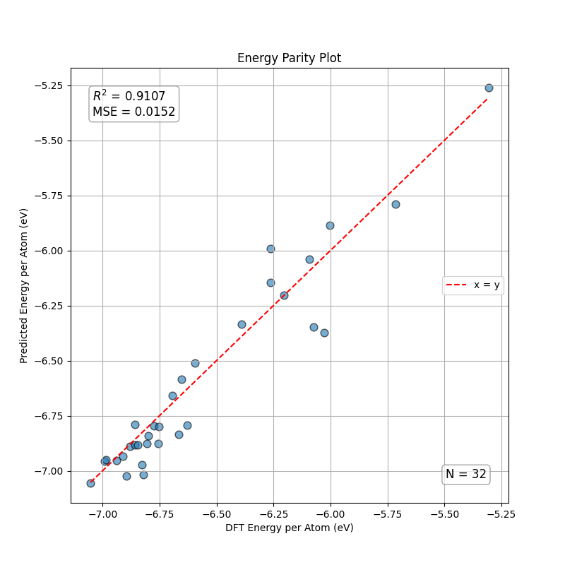
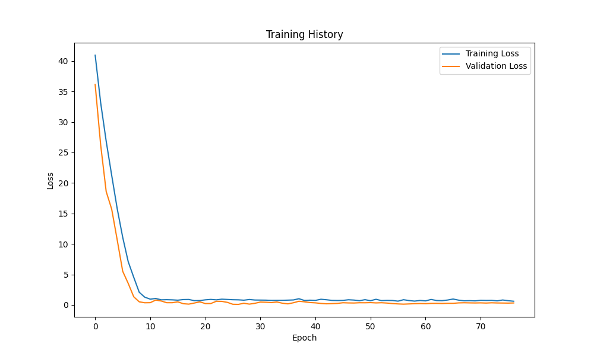

# Enhanced GCN for Atomic Energy Prediction  

  
  
  

---

## Table of Contents  
- [Description](#description)  
- [Technologies Used](#technologies-used)  
- [Project Structure](#project-structure)  
- [Architecture Flow](#architecture-flow)  
- [DFT Data](#dft-data)  
- [Installation & Setup](#installation--setup)  
- [Usage](#usage)  
- [Results](#results)  
- [Acknowledgments](#acknowledgments)  
- [Author](#author)  

---

## Description  
This project implements an **Enhanced Graph Convolutional Network (GCN)** for predicting **atomic energies and forces** from **Density Functional Theory (DFT)** data.  

Unlike vanilla GCNs, this model integrates **distance-aware edge features** and periodic boundary conditions (PBC), improving physical accuracy and outperforming baseline atomistic ML frameworks such as **N2P2**.  

---

## Technologies Used  
- **PyTorch** – Core deep learning framework  
- **PyTorch Geometric** – Graph neural network operations  
- **NumPy, SciPy, pandas** – Scientific computing & preprocessing  
- **Matplotlib, Seaborn** – Visualization & plotting  
- **ASE (Atomic Simulation Environment)** – Parsing and handling DFT outputs  

---

## Project Structure 
```
GNN-CeramicMap/
│
├── src/
│   └── egcn/
│       ├── egcn.py             # Enhanced GCN model
│       ├── dft_processor.py    # DFT → Graph data conversion
│
├── scripts/
│   └── train_eval.py           # Training & evaluation pipeline
│
├── assets/
│   └── plots/                  # Training curves & parity plots
│
├── data/
│   ├── raw/                    # Raw DFT data (ignored in git)
│   └── processed/              # Processed CSV/graph data
│
└── requirements.txt
```

---

## Architecture Flow
```
┌──────────────────────────┐
│     DFT Input Data       │
│   (POSCAR / OUTCAR etc.) │
└───────────┬──────────────┘
            │
            ▼
┌──────────────────────────┐
│  DFT Processor           │
│  • Parse structures      │
│  • Build atom graphs     │
│  • Add edge features     │
└───────────┬──────────────┘
            │
            ▼
┌──────────────────────────┐
│  Enhanced GCN Model      │
│  • Node embeddings       │
│  • Distance-based edges  │
│  • Equivariant layers    │
└───────────┬──────────────┘
            │
            ▼
┌──────────────────────────┐
│   Predictions            │
│  • Energy per atom (eV)  │
└──────────────────────────┘
```
---

## DFT Data  
This model was trained on **ceramic material datasets** obtained from Density Functional Theory (DFT) simulations.  

🔗 [Link to Dataset](#) *https://doi.org/10.20383/103.01365*

Special thanks to [Sara Sheikhi](https://github.com/s-sheikhi), who mentored me throughout and provided access to the DFT dataset and guidance on developing the processor pipeline.  

---
## Installation & Setup  

```bash
# Clone the repository
git clone https://github.com/MuhammadZain2005/GNN-CeramicMap.git
cd GNN-CeramicMap

# Create a virtual environment
python3 -m venv .venv
source .venv/bin/activate   # On Windows: .venv\Scripts\activate

# Install requirements
pip install -r requirements.txt
```
---
## Usage

### Train and Eval model  
```bash
python3 src.scripts.train_eval
```


- Training history plots and parity plots will be saved to:  
  `assets/plots/`

---

## Results  

The results for the best model trained have been shown in the /Results folder. 

<p align="center">
  
  
</p>

---
---

## Acknowledgments  
Special thanks to [Sara Sheikhi](https://github.com/s-sheikhi) for providing the dataset and assisting with the DFT processor file, which was crucial for the success of this project.  

---

## Author  
👤 **Muhammad Zain Asad**  
- 🔗 [LinkedIn](https://www.linkedin.com/in/muhammad-zain-asad-94316b286/)  
- 🔗 [GitHub](https://github.com/MuhammadZain2005)  

---

## License  
This project is licensed under the [MIT License](LICENSE). 
